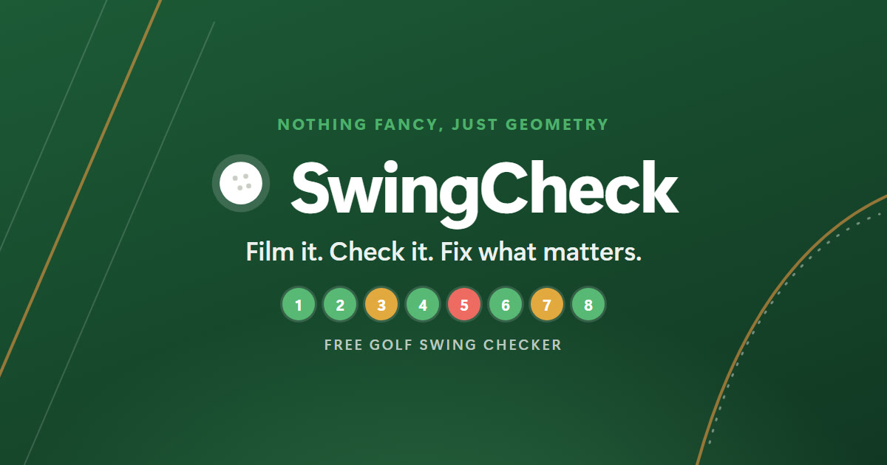

  

  <b>Find the one thing holding your golf swing back, from a single phone video.</b> 
  Free. No sign-up. Results in minutes.

  <a href="https://swingcheck.org"><b>👉 Check your swing at swingcheck.org</b></a>

---

## Stop guessing what's wrong with your swing

Fat shots? Slicing? Wedges ballooning instead of going forward? Most golfers
know *something* is off, but not *what*. SwingCheck watches your swing frame by
frame and tells you the **one thing to work on first**, in plain words, with
what to try.

## How it works

1. **📱 Film** one swing from behind, with your phone on a tripod.
2. **👆 Mark** a few points. A tour pro at the same moment shows you exactly
   what to match and where to click.
3. **✅ Get your results:** every checkpoint graded green, yellow, or red, an
   annotated video, and a clear next step.

## Eight checkpoints, start to finish

| | Checkpoint | What it looks at |
|---|---|---|
| 1 | **Address** | Your posture: arms, spine, knees, and back |
| 2 | **Swing plane** | Whether your club is set up on the right line |
| 3 | **Takeaway** | Whether the club starts back on plane |
| 4 | **Halfway back** | Whether the club points where it should |
| 5 | **Top** | Your front arm, and where your hands are |
| 6 | **Downswing** | Whether you come over the top or drop it in |
| 7 | **Impact** | Whether you stand up early (early extension) |
| 8 | **Follow-through** | Whether the club exits on the same line |

🟢 **Good**: you're where good players are. 🟡 **Watch**: worth a look.
🔴 **Fix**: work on this. Every result shows its measurement in centimetres or
degrees, next to the good range.

## Why golfers like it

- **One clear priority.** Not a wall of numbers: the fault that matters most,
  with how to fix it.
- **Made for real practice.** Range, backyard, or simulator bay: all you need is
  a phone and a tripod.
- **Easy to follow.** A pro example guides every step of marking.
- **Share it with your coach or friends** as a one-page PDF link, with a preview
  in chat apps.
- **Irons and drivers, right- and left-handed,** each with their own ranges.
- **Private.** No account, no email. Your swings are yours alone, and deleted
  after 3 days.
- **Free.** No subscription, no ads.

## Ready to try it?

1. Read the 2-minute [filming guide](docs/user-guide.md#1-filming-your-swing).
2. Film a swing.
3. Upload it at **[swingcheck.org](https://swingcheck.org)**.

New to it? The [user guide](docs/user-guide.md) walks through every step.

> **Alpha.** SwingCheck is new and improving every week. Features and results
> may change. Results are estimates from video, for practice, not a replacement
> for a coach.

## Support SwingCheck

SwingCheck is free. If it helps
your game, you can [support it on Ko-fi](https://ko-fi.com/jeromegarcia) to
help cover the server costs. Thank you!

In the Philippines? Support with InstaPay: scan this with GCash, Maya, or your banking app.

---

## For developers

SwingCheck can also run on your own computer, where nothing leaves your machine.
It's built with Python, OpenCV, MediaPipe Pose, and ffmpeg.

- [Developer guide](docs/development.md): setup, code layout, testing, and releasing.
- [Checkpoints and ranges](docs/checkpoints.md): exactly what each checkpoint measures.
- [Hosting and operations](docs/hosting.md): how swingcheck.org runs.
- [Release notes](docs/releases/): what's new in each release.
